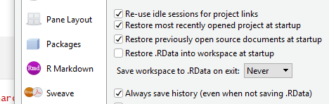

```{r setup, include=FALSE}
knitr::opts_chunk$set(echo = TRUE)
```

## What does reproducible research look like in R?[^1]


1. What did I do?
2. Why did I do it?
3. How did I set up everything at the time of the analysis?
4. **When did I make changes, and what were they?**
5. Who needs to access it, and how can I get it to them?

[^1]: http://t-redactyl.io/blog/2016/10/a-crash-course-in-reproducible-research-in-r.html

## Do you use `setwd()`?


##### Why is this not a good practice?
**Solution**

1. If you don't know or follow Jenny Bryan check her out. She is awesome:
    + https://twitter.com/JennyBryan
1. Take advantage of Projects!
    + Use them. Starting right now.
    + If you don't know how, we will fix that.
    + Seriously, I won't continue until everyone promises to use projects.

## Does your script start out like this?


##### Why is this not a good practice?

**Solution**

2. Don't use `save.image` to save objects: `save.image("bad.RData")`
    + Use `saveRDS()` and `readRDS()`

This is not recommended!
```{r data}
x <- 1
y <- 2
save.image()
```

Why?
```{r}
x <- list("important information is stored here", ", but it's going to be overwritten!!!")
x
load(".RData")
x
y
```

This is better
```{r data_better}
x <- 1
y <- 2
saveRDS(x, "data/x.rds")
saveRDS(y, "data/y.rds")
x <- readRDS("data/x.rds")
y <- readRDS("data/y.rds")
x
y
```

#### This is best
```{r data_best}
data_path <- "data"

saveRDS(x, file.path(data_path, "x.rds"))
saveRDS(y, file.path(data_path, "y.rds"))

x <- readRDS(file.path(data_path, "x.rds"))
y <- readRDS(file.path(data_path, "y.rds"))
x
y
```
#### Why?

1. `file.path` is OS agnostic

    ...works on Windows, Linux, Mac :)

    Really good for portability.
    
2. What if you add different data in another folder called `data2`?
    
    It's way too easy to miss manually typing or copy/replace
    
    Code so that when you make a change it's gets propragated automatically!

```{r eval=FALSE}
saveRDS(x, "data2/x.rds")
saveRDS(y, "data2/y.rds")
x <- readRDS("data/x.rds")
y <- readRDS("data2/y.rds")
```

3. The `here` package offers a nice replacement for `file.path`

```{r here, echo=TRUE}
here::here()
here::dr_here() # Provides an explanation for why `here` decided it should be `here`
```

## File and Directory management

### File Naming[^4]

**Put time and thought into naming your files and directories**

Future you will be grateful!

Stolen from here: https://speakerdeck.com/jennybc/how-to-name-files

Go read this afterwards!


[^4]: https://speakerdeck.com/jennybc/how-to-name-files

#### Directory structure

TODO: Write something profound here. TLDR: If going to share code or write a package use typical package structure. Otherwise use obvious directory names.

### Data

#### Disable auto save and restore workspace!

It's not a good idea to save your workspace and automatically load it at startup.

+ can mask code issues that are only discovered later
+ Big objects (10s to 1000s of MB will take a long time to save and load)

1. Tools
2. Global Options
3. 

4. Be brave! Pressing ctrl+shift+f10 should not be scary. It's a sign that you have set up your work for RR and you can be confident in your reproducible workflow.

## Tests

TODO: incorporate Unit testing talk information here...

## Session information and Package Management

We have all been there. You want to rerun an analysis from 3 years ago and something bad happens. Bad varies from getting unspecified errors to debug to the worst case where code runs but you get a vastly different answer.

### Session Information

There is an easy way to see what versions of base R and installed packages are loaded into your current session.
```{r}
sessionInfo()
```

```{r}
output_dir <- "output"
session_fname <- "sessionInfo.txt"
session_key <- file.path(output_dir, session_fname)
writeLines(capture.output(sessionInfo()), session_key)
```

This looks like extra work.

**Why would I do extra work?**

**Also isn't that harder to read then this:**

```{r eval=FALSE, include=TRUE}
writeLines(capture.output(sessionInfo()), "output/SessionInfo.txt")
```

There is a tension between working in **script** mode vs **production** mode.

It's up to you to decide where to draw that line.

It's not efficient to always code in __production__ mode...

However, if you find that you need to reuse or share code, then work in __production__ mode.

With the first version we can easily untangle configurable options from the script and set those at run time if running the script from a terminal as `arguments` or read them in from a configuration file.

TODO: more on this later.

Worst case, you can move all of your variables to set to the top of your script to glance over them all at once instead of ctrl-f'ing your way through your code.

Setting everything in one place is a good pattern.

#### Install a package from a snapshot in time

MRAN is is a daily snapshot of CRAN the Microsoft hosts to be used in conjunction with its `Checkpoint` package.

Change all installed packages to particular point in time.
```{r echo = TRUE}
#checkpoint::checkpoint("YYYY-MM-DD")
```

Install only one package at a particular point in time
```{r echo = TRUE}
#install.packages('xfun', repos='https://mran.microsoft.com/snapshot/2017-12-31/', dependencies=TRUE)
```

#### Install a specific package version

The package `devtools` allows you to easily install a specific version of a package.
```{r echo = TRUE}
#devtools::install_version("xfun", version = "0.4", repos = "http://cran.us.r-project.org")
```

### Potential issues[^2]

1. You may be losing functionality or bug fixes that are only present in the newer versions of the packages.
2. The older package version needed may not be compatible with the version of R you have installed.
3. In this case, you will either need to downgrade R to a compatible version or update your R code to work with a newer version of the package.

[^2]: https://support.rstudio.com/hc/en-us/articles/219949047-Installing-older-versions-of-packages

### Package Management

If you look the third sub-tab on the `Packages` tab in the `Files` pane, you will see a mysterious thing called `Packrat`.

It is R Studio's built in package management system. It records information about packages used in a `project` and downloads all of them for specifically that project

Takes up more space because it repeats every package for each project.

TODO: How to use `Packrat` demo???

## Literate Programming

Literate programming is a programming paradigm introduced by Donald Knuth in which a program is given as an explanation of the program logic in a natural language, such as English, interspersed with snippets of macros and traditional source code, from which a compilable source code can be generated[^3]

[^3]:https://en.wikipedia.org/wiki/Literate_programming

How to do this in R?

R markdown!

```{r}
print("This is literate programming :)")
```

#### Bibliography